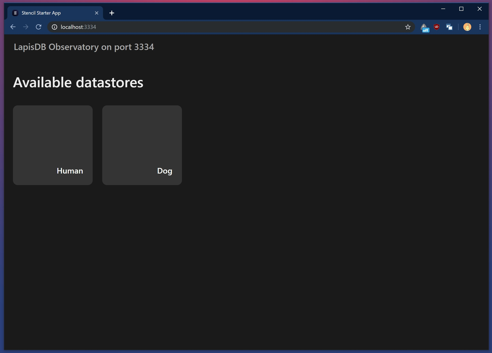
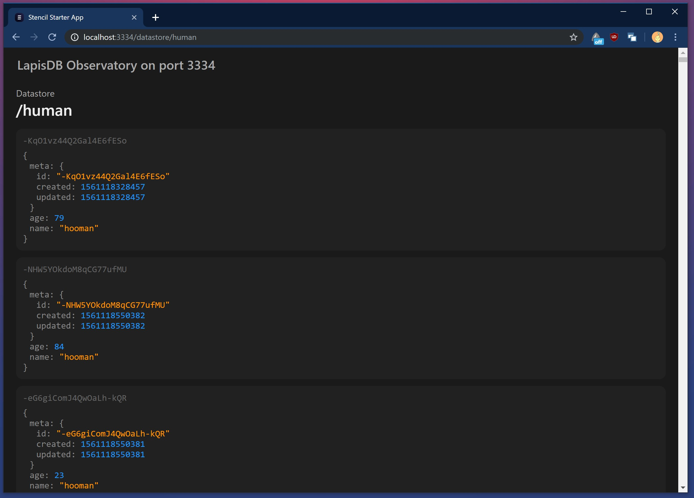

# 💥 LapisDB Observatory

[](https://github.com/kekland/lapisdb_observatory)
[](https://github.com/kekland/lapisdb_observatory/fork)
[](https://github.com/kekland/lapisdb_observatory)

A web observatory for [**LapisDB**](https://github.com/kekland/lapisdb).

## ❗ Attention

I am still working on this project, and many things **might change in future**.

## Screenshots




## 💾 Installation

[**Download via NPM**](https://https://www.npmjs.com/package/lapisdb_observatory)

```bash
cd my-awesome-project
npm install --save lapisdb_observatory
```
## 🔨 How do I use it?

First of all, you need to create LapisDB datastores - if you are wondering how to do it, check out this [link](https://github.com/kekland/lapisdb).

Then, you create LapisObservatory object:
```ts
const myDatastore = new Datastore(...)

const observatory = new LapisObservatory([myDatastore])
```

And then, you just start the observatory
```ts
observatory.listen(9009)
```

Yes, it is that simple!

When you build and start your server, it will print information about its routes in terminal.
```bash
Starting LapisObservatory on port 9009

[Datastore human] listening on route /human and /human/:id
[Datastore dog] listening on route /dog and /dog/:id

LapisObservatory started on port 9009
```

Then, you can open your web browser and navigate to `localhost:9009/human` :)

## 📧 Contact me

**E-Mail**: `kk.erzhan@gmail.com`
